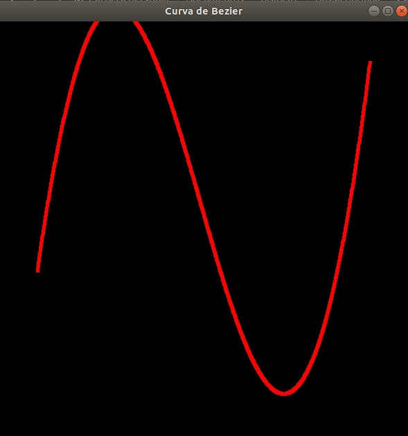
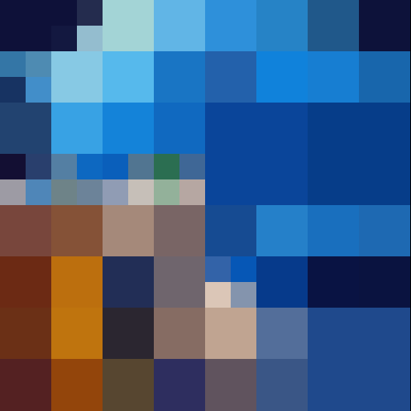
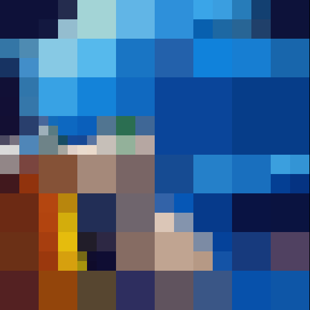
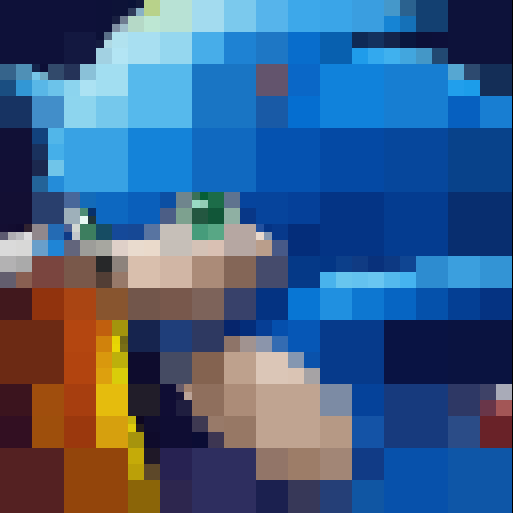
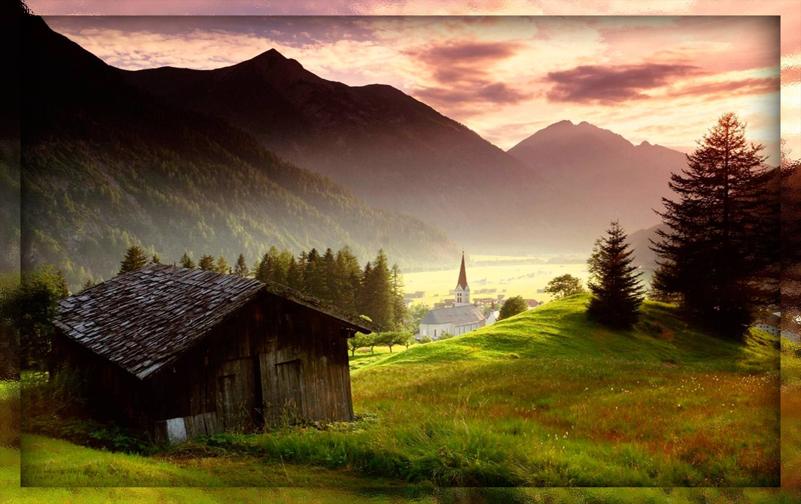
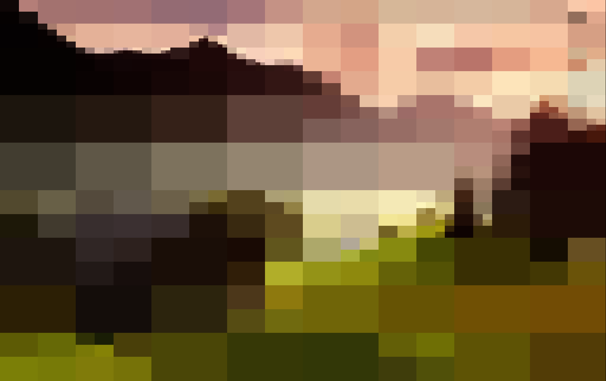

# Laboratorio 3 de Grafica
**Algoritmo de la curva de Bézier**:Su funcionamiento recae en la siguiente parte de codigo.

```void bezier (wcPt3D * ctrlPts, GLint nCtrlPts, GLint nBezCurvePts)
{
	wcPt3D bezCurvePt;
	GLfloat u;
	GLint *C, k;
	/* Reserva espacio para los coeficientes binomiales*/
	C= new GLint [nCtrlPts];
	
	binomialCoeffs (nCtrlPts - 1, C);
	for (k=0; k <= nBezCurvePts; k++) {
	u = GLfloat (k) / GLfloat (nBezCurvePts);
	computeBezPt (u, &bezCurvePt, nCtrlPts, ctrlPts, C);
	plotPoint_b (bezCurvePt);
	}
	delete [ ] C;
}
```


**Cuatree**: Realiza subdivición de la imagen en bloques de cuatro, sucesivamente hasta, llegar la profundidad indicada. Obteniendo una imagen simplificada. 
Los resultados de una imagen de caricatura son:

Entrada


Realiza los siguientes pasos para la imagen de una caricatura con una profundidad de 128(solo se muestra algunos, todas las imágenes creados son descritas en la carpeta framessonic):






Salida


Asimismo se realiza con la imagen de un paisaje:

Entrada


Se subdivide con una profundidad de 32 y son descritos en carpeta frames

Salida



En conclusion, observamos que la caricatura, puede reflejar con mayor visibilidad los colores, mientras que en el paisaje, al tener varios objetos en la imagen, lo vuelve no comprensible. Tambien implica la cantidad de profundidad que le damos al quatree a mayor cantidad mayor visibilidad de la imagen.
